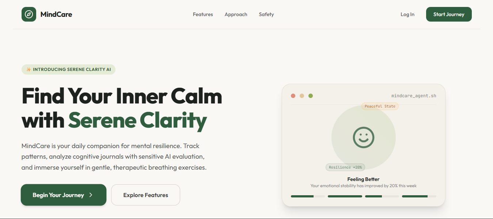
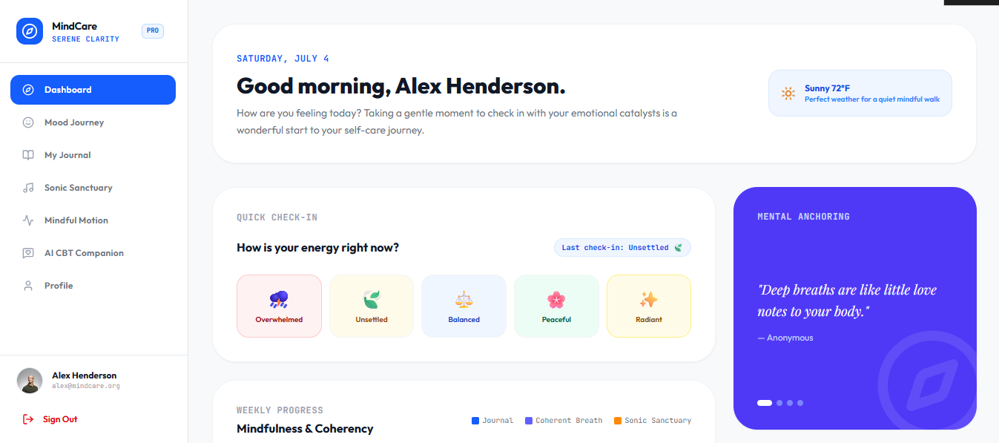
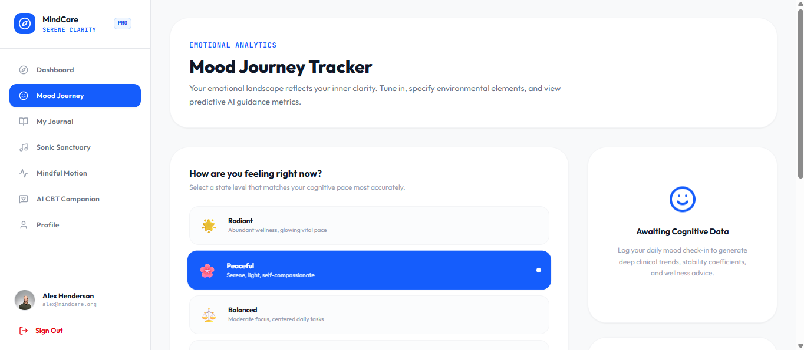
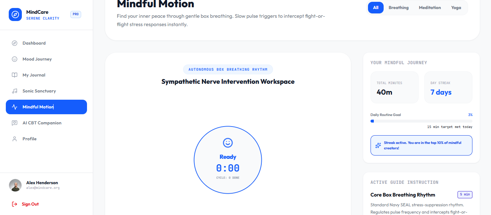
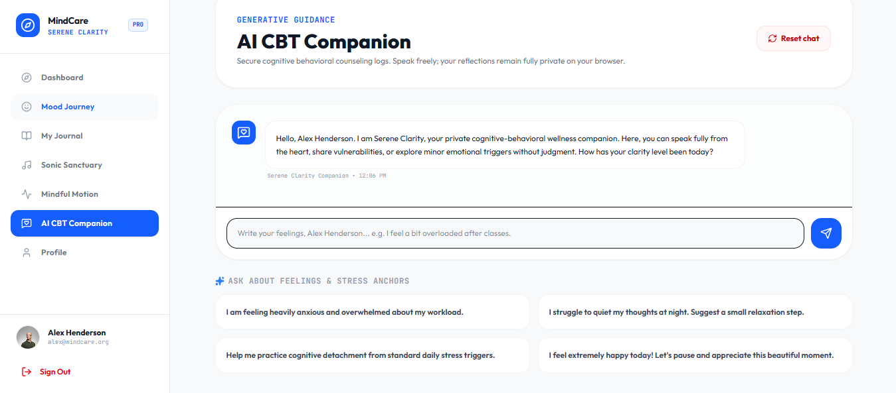
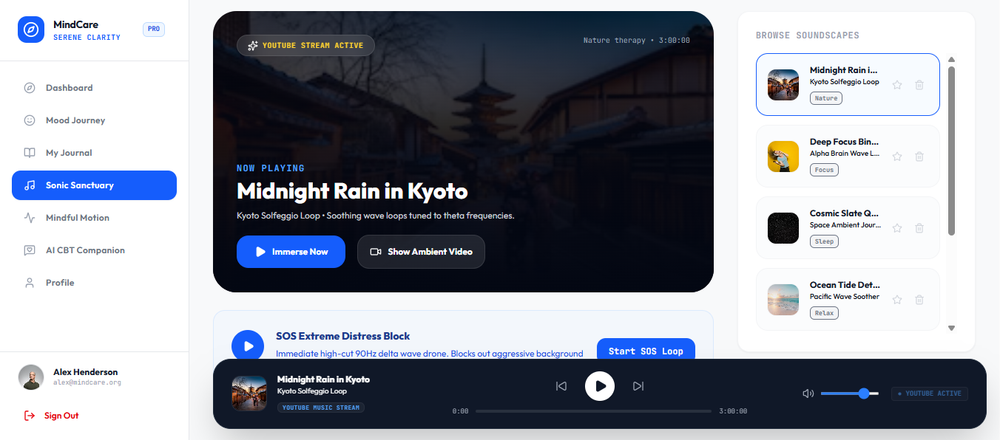

<h1 align="center">
  🧠 MindCare – AI-Powered Mental Healthcare Platform
</h1>

<p align="center">
  <b>A modern AI-powered mental wellness platform designed to help users track emotions, reduce stress, and improve mental wellbeing through intelligent insights and self-care tools.</b>
</p>

<p align="center">


</p>

---

# 👨‍💻 Developer

### **Yashwant Singh Raghav**

🎓 MCA Student

💻 Passionate about AI, Web Development & Data Analytics

⭐ If you like this project, don't forget to **Star** the repository.

GitHub:
https://github.com/yashwant-raghav

---

# 📖 Project Overview

**MindCare** is an AI-powered Mental Healthcare Web Application developed to support individuals in monitoring and improving their mental wellbeing.

The platform combines Artificial Intelligence, mood tracking, journaling, guided exercises, meditation music, and intelligent emotional analysis into a single easy-to-use application.

Users can maintain their emotional health, identify stress patterns, write personal journals, receive AI-generated insights, and practice mindfulness through an intuitive interface.

The application focuses on providing a safe, private, and user-friendly environment for improving daily mental wellness.

---

# ✨ Features

## 🏠 Beautiful Dashboard

- Modern UI
- Daily progress
- Wellness statistics
- Quick navigation

---

## 😊 Mood Tracking

- Daily mood logging
- Emotional history
- Mood analytics
- Progress visualization

---

## 📔 Personal Journal

- Secure journal entries
- Daily notes
- Emotional reflection
- AI-assisted journal analysis

---

## 🤖 AI Mental Health Assistant

Powered by Google Gemini AI

Features:

- Emotional support
- Mental wellness suggestions
- CBT-inspired guidance
- Stress analysis
- Personalized recommendations

---

## 🎵 Music Therapy

Relax with calming sounds:

- Rain
- Nature
- Forest
- Ocean
- Meditation music

---

## 🧘 Mindful Exercises

- Yoga
- Stretching
- Breathing exercises
- Relaxation techniques
- Meditation sessions

---

## 👤 User Profile

- Personal information
- Wellness statistics
- Activity history
- Progress tracking

---

## 🔐 Authentication

- User Registration
- Login
- Secure Authentication
- Local user management

---

## 📊 Mental Health Analysis

- Emotional trends
- Mood reports
- AI-generated insights
- Wellness score

---

# 🚀 Technology Stack

## Frontend

- React
- TypeScript
- HTML5
- CSS3
- Vite

---

## Backend

- Python
- Flask

---

## Database

- SQLite

---

## AI

- Google Gemini API

---

## Languages Used

- Python
- TypeScript
- JavaScript
- HTML
- CSS
- SQL

---

# 📂 Project Structure

```
MindCare/
│
├── src/
│   ├── components/
│   │
│   ├── Auth.tsx
│   ├── Dashboard.tsx
│   ├── LandingPage.tsx
│   ├── MoodJourney.tsx
│   ├── MyJournal.tsx
│   ├── AIAssessment.tsx
│   ├── SonicSanctuary.tsx
│   ├── MindfulMotion.tsx
│   ├── Profile.tsx
│   └── Sidebar.tsx
│
├── app.py
├── database.py
├── mindcare.db
├── package.json
├── vite.config.ts
├── tsconfig.json
└── README.md
```

---

# ⚙ Installation

## 1 Clone Repository

```bash
git clone https://github.com/yashwant-raghav/mindcare.git
```

---

## 2 Move into Project

```bash
cd mindcare
```

---

## 3 Install Frontend Dependencies

```bash
npm install
```

---

## 4 Install Python Dependencies

```bash
pip install -r requirements.txt
```

---

## 5 Run Backend

```bash
python app.py
```

---

## 6 Run Frontend

```bash
npm run dev
```

---

Open browser

```
http://localhost:5173
```

---

# 📸 Screenshots

## Home Page

<p align="center">
  
</p>

> Beautiful landing page introducing MindCare with AI-powered mental wellness features.


---

## Dashboard

<p align="center">
  
</p>

> Personalized dashboard displaying wellness insights, daily check-ins, mindfulness progress, and motivational content.


---

## Mood Tracker

<p align="center">
  
</p>

> Track emotions, monitor mental health trends, and receive AI-generated wellness insights.


---

## Mindful motion

<p align="center">
  
</p>

> Practice guided breathing exercises, mindfulness routines, meditation, yoga, and stress-relief activities.


---

## AI Chatbot

<p align="center">
  
</p>

---

## Music Therapy

<p align="center">
  
</p>

> Relax with calming music, meditation soundscapes, YouTube integration, and ambient therapy sessions.


---

# 🎯 Project Objectives

- Improve mental wellbeing
- Encourage healthy habits
- Reduce stress
- Track emotional patterns
- Provide AI assistance
- Promote mindfulness
- Support self-care

---

# 🔮 Future Enhancements

- Therapist Booking
- Video Consultation
- Appointment Scheduling
- Email Notifications
- Mobile Application
- Dark Mode
- Cloud Database
- Admin Panel
- Community Support
- Daily Challenges
- Habit Tracker
- Wearable Integration
- Multi-language Support
- PDF Reports
- Voice Assistant

---

# 📈 Project Highlights

✅ AI-Powered Mental Health Assistant

✅ Mood Tracking

✅ Personal Journal

✅ Music Therapy

✅ Guided Exercises

✅ User Authentication

✅ Mental Health Dashboard

✅ Modern Responsive UI

✅ Google Gemini AI Integration

✅ SQLite Database

---

# 🤝 Contributing

Contributions are welcome.

1. Fork Repository

2. Create New Branch

```bash
git checkout -b feature-name
```

3. Commit Changes

```bash
git commit -m "Added new feature"
```

4. Push Changes

```bash
git push origin feature-name
```

5. Open Pull Request

---

# 🛡 License

This project is licensed under the **MIT License**.

---

# 🙏 Acknowledgements

Special thanks to

- Google Gemini AI
- React Community
- Flask Community
- Vite
- Open Source Contributors

---

# 📬 Contact

## Yashwant Singh Raghav

GitHub

https://github.com/yashwant-raghav

---

<h3 align="center">
⭐ If you found this project useful, please consider giving it a Star ⭐
</h3>

<h3 align="center">
Made with ❤️ by Yashwant Singh Raghav
</h3>
